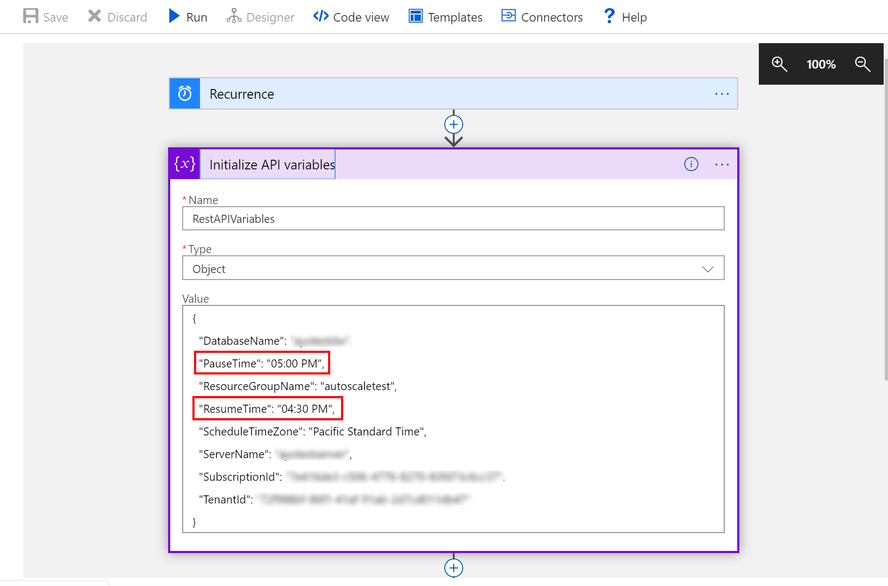
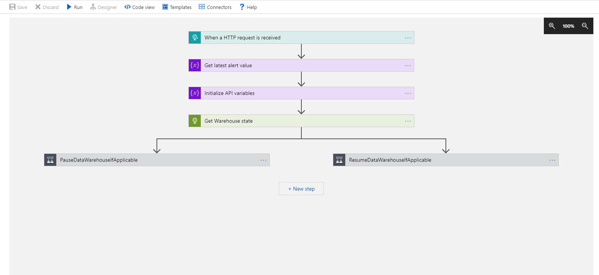
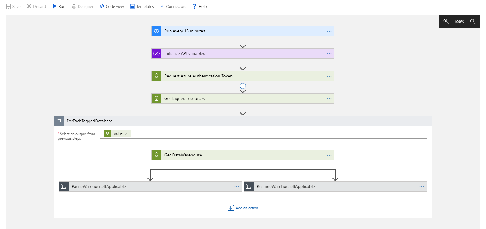

# SQL Data Warehouse Auto-Pause and Auto-Resume using Logic apps

This sample includes 3 templates to showcase different scenarios for using Logic apps to pause and resume compute resources for a SQL Data Warehouse

## Scenario 1: Scheduled pause and resume for a single data warehouse


In this scenario, you deploy a timer-based Logic app configured with a [service managed identity that is used to authenticate to SQL Data Warehouse](https://docs.microsoft.com/en-us/azure/active-directory/managed-identities-azure-resources/overview). The Logic app issues pause and resume commands to the data warehouse based on the pause-resume schedule configured during deployment. 

**1. Deploy timeschedule-based autopause and autoresume template**

> [!NOTE]
> You will need an existing SQL Data Warehouse to deploy the template below. 

* Use the server-name and database-name properties of your data warehouse, and a pause-resume schedule to complete the deployment. 
* You can additionally specify the timezone for the pause-resume schedule, and if the schedule should only run on weekdays.

<a href="https://portal.azure.com/#create/Microsoft.Template/uri/https%3A%2F%2Fsqldwexternaldata.blob.core.windows.net%2Farmtemplates%2FScheduledAutoPauseResumeDW.json" target="_blank">

</a>

**2. Configure database access permissions for logic app**

> [!NOTE]
>
> To successfully complete this step, your account will need 'Owner' permissions on your data warehouse, or the permission to assign roles to other users

Your logic app will need permissions to access your data warehouse. You will provide this using the Azure Cloud Shell:

1. [Launch the Azure Cloud Shell](https://shell.azure.com/) 
2. Configure the shell for a Bash scripting environment
	

3. Set the active subscription to the subscription containing your data warehouse

	```
	az account set --subscription <Subscription ID>
	```

4. Configure 'Contributor' access for your logic app using the command below.
	* Substitute the relevant parameters for your deployment in the *SubscriptionId*, *ResourceGroupName*, *ServerName*, and *DatabaseName* variables below
	* You can find the 'ObjectId' identity for your logic app in the 'Identity' section of the logic app settings blade. 
	


	```
	az role assignment create --assignee-object-id <LogicApp ObjectId> --role Contributor --scope "/subscriptions/<subscriptionId>/resourceGroups/<resourceGroupName>/providers/Microsoft.Sql/servers/<serverName>/databases/<databaseName>"
	```

Your Logic app is now configured to pause and resume your data warehouse at the times you scheduled.

**3. Optionally modify pause-resume schedule**

If you would like to modify the pause-resume schedule configured during deployment, navigate to the Logic app and select the 'Initialize API variables' activity. Expand the activity to reveal the variables used for orchestration. 

* Modify the 'PauseTime' key to change the pause schedule
* Modify the 'ResumeTime' key to change the time the resume schedule
* Make sure to update the 'Recurrence' activity to reflect the changes in 'PauseTime', or 'ResumeTime'



## Scenario 2: Event-based pause and resume for a single data warehouse



In this scenario, you deploy an event-based Logic app configured with a [service managed identity that is used to authenticate to SQL Data Warehouse](https://docs.microsoft.com/en-us/azure/active-directory/managed-identities-azure-resources/overview). The Logic app uses Azure alerts to determine when to autopause and autoresume a SQL Data Warehouse. 

**1. Deploy event-based autopause and autoresume template**

> [!NOTE]
> You will need an existing SQL Data Warehouse to deploy the template below.

* The template below deploys a Logic app, and two metric alerts to trigger pause and resume activities.
* Use the server-name, and database-name properties of your data warehouse to complete the deployment. 

<a href="https://portal.azure.com/#create/Microsoft.Template/uri/https%3A%2F%2Fsqldwexternaldata.blob.core.windows.net%2Farmtemplates%2FEventbasedAutoPauseResumeDW.json" target="_blank">

</a>

**2. Configure database access permissions for logic app**

> [!NOTE]
>
> To successfully complete this step, your account will need 'Owner' permissions on your data warehouse, or the permission to assign roles to other users

Your logic app will need permissions to access your data warehouse. You will provide this using the Azure Cloud Shell:

1. [Launch the Azure Cloud Shell](https://shell.azure.com/) 
2. Configure the shell for a Bash scripting environment
	

3. Set the active subscription to the subscription containing your data warehouse

	```
	az account set --subscription <Subscription ID>
	```

4. Configure 'Contributor' access for your logic app using the command below.
	* Substitute the relevant parameters for your deployment in the *SubscriptionId*, *ResourceGroupName*, *ServerName*, and *DatabaseName* variables below
	* You can find the 'ObjectId' identity for your logic app in the 'Identity' section of the logic app settings blade. 
	


	```
	az role assignment create --assignee-object-id <LogicApp ObjectId> --role Contributor --scope "/subscriptions/<subscriptionId>/resourceGroups/<resourceGroupName>/providers/Microsoft.Sql/servers/<serverName>/databases/<databaseName>"
	```

Your Logic app is now configured to autopause your data warehouse after a period of inactivity and resume on the first query attempt.

**3. Optionally modify alert triggers**

The default alert triggers are set to:

* Pause the data warehouse after 1 hour of inactivity
* Resume the warehouse after the first failed login attempt from any query tool. 

If you would like to modify these settings, navigate to your data warehouse resource group, and select the 'Alerts' settings. Click the 'Manage alert rules' button to manage the existing alert rules - these alerts are configured with 'dwPauseAlert' or 'dwResumeAlert' prefixes.


## Scenario 3: Scheduled pause and resume for a fleet of data warehouses



In this scenario, you deploy a timer-based Logic app that uses a service principal to autopause and autoresume a fleet of data warehouses. The Logic app uses Azure tags to identify both candidate data warehouses and their pause-resume schedules. The app also uses a [user-managed Azure service principal](https://docs.microsoft.com/en-us/azure/active-directory/develop/app-objects-and-service-principals) to authenticate to the various data warehouses and issue pause and resume commands. 

**1. Create a service principal and configure access permissions**

Your logic app will need permissions to access all data warehouses you intend to autopause or autoresume. You will configure this using the Azure Cloud Shell:

> [!NOTE]
>
> To successfully complete this step, your account will need to have permission to create a service principal

1. [Launch the Azure Cloud Shell](https://shell.azure.com/) 
2. Configure the shell for a Bash scripting environment
	

3. Set the active subscription to the subscription containing your data warehouse

	```
	az account set --subscription <Subscription ID>
	```

4. Create a service principal and configure access using the command below.
	* Enter a service principal name for the *ServicePrincipalName* parameter below
	* Make sure to copy the **appId**, and **password** outputs from the command, they will be used later

	```
	az ad sp create-for-rbac --name <ServicePrincipalName> --role Contributor
	```

**2. Deploy timeschedule-based autopause and autoresume template**

* Use the applicationId and password properties of your service principal to complete the deployment. 
* You can additionally specify the default timezone that will be used for the pause-resume schedule

<a href="https://portal.azure.com/#create/Microsoft.Template/uri/https%3A%2F%2Fsqldwexternaldata.blob.core.windows.net%2Farmtemplates%2FScheduledAutoPauseResumeDWFleet.json" target="_blank">

</a>

**3. Add tags to candidate databases**

> [!NOTE]
>
> A data warehouse must be online to be successfully tagged with values

To use the Logic app on a data warehouse, add the following tags to the data warehouse instance using the format specified below. For the logic app to discover the data warehouse instance, they both must belong to the same subscription.

* AutoSchedulePauseTime: HH:MM (AM/PM)
* AutoScheduleResumeTime: HH:MM (AM/PM)

You can optionally specify a timezone that an individual data warehouse will use for the pause-resume schedule:

* AutoScheduleTimeZone: [\<TimeZoneName> from Microsoft Time Zone Index Values](https://docs.microsoft.com/en-us/previous-versions/windows/embedded/ms912391(v=winembedded.11))


    ​
